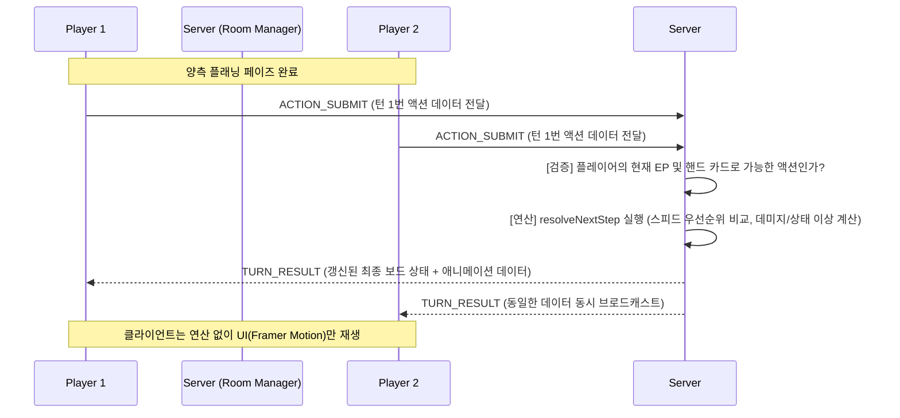

# TCB v3.0 마스터 플랜: 실시간 온라인 PvP 및 모바일 패키징

본 문서는 기존 로컬/AI 대전 기반의 "Turn Card Battle V2"를 **서버 기반 실시간 멀티플레이어 환경(Online PvP)**으로 전환하고, **모바일 스마트폰 환경(Touch & App)**에 맞게 최적화하는 마스터 플랜입니다. 
AI 파트너(안티그래비티)와 개발을 진행할 때 이 문서(`plan.md`)를 기준으로 단계별로 상세 작업을 수행합니다.

---

## [Step 1] 실시간 통신 인프라 및 서버 아키텍처 설계

**목표**: 유저 간 실시간 양방향 통신을 위한 고성능 소켓 아키텍처를 도입하고 대기실(Room) 형태의 세션 관리를 구축합니다.

### 1. 기술 스택 선정: 독립형 Express + Socket.io 구조
Next.js의 API Routes(Serverless)는 지속적인 핑퐁을 요구하는 웹소켓 통신에 불안정할 수 있습니다. 따라서 프로젝트 내 별도 폴더(예: `src/server/`)에 분리된 Node.js 기반 **Express + Socket.io** 전용 서버를 돌리거나, Next.js의 Custom Server(`server.js`)를 띄우는 방식을 채택합니다.
*(장기적으로는 상태 관리 프레임워크인 Colyseus.js 도입을 고려할 수 있으나, 초기 뼈대는 Socket.io로 세팅하여 제어력을 극대화합니다.)*

### 2. 기본 통신 연결 아키텍처
- **CONNECT**: 클라이언트가 게임 로비 접속 시 JWT 기반 Next-Auth 세션 토큰을 소켓 통신 헤더(또는 auth payload)에 담아 인증 요청.
- **DISCONNECT**: 브라우저 종료/네트워크 단절 시 서버에서 임시 `disconnected` 상태로 전환(Step 5 참조).
- **ROOM ENTER**: 매칭 완료 시 유니크한 룸 ID(예: `uuid`)를 발급하여, 승자와 패자가 결정될 때까지 양쪽 유저를 단일 소켓 방(Room)에 격리.

---

## [Step 2] 게임 엔진의 서버 이관 (Server Authority)

**목표**: 치트 엔진 등 클라이언트 변조를 원천 차단하기 위해, 모든 기력 계산 및 데미지 연산을 서버가 관장하는 방식(검증 중심)으로 아키텍처를 변경합니다.

### 1. `store.ts` 분할 방안
기존 클라이언트 상태 관리자(`src/engine/store.ts`)에 구현된 `resolveNextStep`, `applyDamage`, 상태 이상 로직을 서버 단의 인스턴스로 분리합니다. 
서버는 **ServerEngine** 클래스를 메모리에 띄워 해당 방(Room)의 마스터 상태(State)를 보유합니다.

### 2. 시퀀스 다이어그램: 클라이언트 - 서버 검증



---

## [Step 3] 실시간 매치메이킹 및 전투 동기화

**목표**: 로비에서 플레이어 간 1:1 대결을 매칭하고, 동시에 행동을 계획하는 교차 턴(simultaneous turns) 시스템의 네트워크 프로토콜을 정의합니다.

### 1. 매치메이킹 큐 (Data Schema)
```typescript
interface MatchQueueUser {
  socketId: string;
  userId: string;
  deck: string[];      // 사용하는 덱 정보
  character: string;   // 접속 캐릭터 정보
}
```

### 2. 소켓 이벤트 프로토콜 명세
- `MATCH_FIND` (Client->Server): 대전 탐색 시작 (큐에 진입)
- `MATCH_FOUND` (Server->Client): 매칭 성사, `roomId` 및 상대방 프로필 정보 전송 후 전투 화면으로 라우팅
- `ACTION_SUBMIT` (Client->Server): 카드 사용/이동 등 제출. 이때 한쪽만 먼저 보내면 서버는 `ACTION_WAITING` 상태로 둔다.
- `TURN_RESULT` (Server->Client): 양쪽 모두 `ACTION_SUBMIT`이 도달했을 때만 서버에서 결과를 계산하여 동시에 발송
- `OPPONENT_LEFT` (Server->Client): 한쪽 유저가 이탈(기권/강제종료)했을 때 잔류 유저에게 승리 판정 전달

---

## [Step 4] 모바일 UI/UX 최적화 및 하이브리드 패키징

**목표**: PC 브라우저 클릭 전용이었던 UI를, 스마트폰 터치 환경에 맞는 반응형/액션형 UX로 대폭 개편하고 APK로 패키징합니다.

### 1. 반응형 필드(FieldBoard) 환경 조정
- 기존 3x3 보드를 모바일 세로 모드(Portrait)에서는 화면 하단에 큼직하게 배치하고, 상단부에는 상대방 상태창과 내 상태창을 직관적으로 밀집시킵니다.
- 미디어 쿼리(`@media`) 기반으로 모바일 뷰에서는 불필요한 빈 여백과 이펙트를 경량화합니다.

### 2. 터치 최적화 UI (HandSystem 개편)
- PC: 호버(Hover) 시 카드가 올라오고 클릭 시 타겟팅.
- **모바일**: **1Tap** 시 화면 중앙에 카드가 크게 팝업되어 비용/효과 상세 확인. 이 상태에서 **상단으로 쓸어올리기(Drag Up)** 혹은 "사용" 버튼을 눌러야 타겟팅 모드로 진입하도록 오작동(Miss-tap)을 방지합니다.
- Safe Area (iPhone 노치 등) 대응 CSS 패딩을 적용합니다.

### 3. Capacitor 연동 (Build to App)
- `npm install @capacitor/core @capacitor/cli`
- `npx cap init` 후 Next.js 빌드 파일 스태틱 익스포트 경로(`out/`) 세팅.
- `npx cap add android` 기반으로 Android Studio 연동 및 테스트 환경 구축.

---

## [Step 5] 네트워크 복구 및 최종 안정화

**목표**: 지하철, 엘리베이터 이동 등 모바일 환경 특유의 일시적 네트워크 끊김을 방어하고 공정한 턴 타임아웃 룰을 강제합니다.

### 1. 상태 스냅샷 및 재접속 로직 (Reconnection)
- **In-Memory 상태 스토리지**: 소켓 서버 내 `rooms` 객체에 게임 진행 상태를 기록해 둡니다.
- 유저 A가 튕겼을 때 상대방(B)에게 즉시 "상대방 연결 끊김, 재접속 대기 중 (30초)" 팝업을 띄우고 카운트다운을 가동합니다.
- 유저 A가 새로고침 하거나 다시 앱을 켰을 때, `CONNECT` 과정에서 이전에 접속 중이던 `roomId`를 서버에서 체크하고, 끊기기 직전의 최신 `TURN_RESULT`의 상태 스냅샷을 통째로 쏴주어 화면을 즉시 복원합니다.

### 2. 턴 제한 시스템 (Time-out)
- 서버는 매 턴이 시작될 때 30초의 `setTimeout`을 가동합니다.
- 30초 내에 양쪽 중 한쪽이라도 `ACTION_SUBMIT`을 쏘지 않으면 발송하지 않은 쪽은 강제로 **"휴식(Rest)"** 처리하거나 액션 없이 턴을 넘기는 로직을 작동시킵니다.

---

💡 **AI 파트너(안티그래비티) 활용 가이드**
이후 개발을 지시하실 때는 "안티그래비티, plan.md 의 [Step 1]을 진행해줘. Socket 서버 기초를 세팅하고 연결 이벤트를 만들어봐." 와 같이 특정 단계를 지목해주시면 해당 마일스톤에만 집중해 완벽하게 구현을 뽑아내겠습니다.
